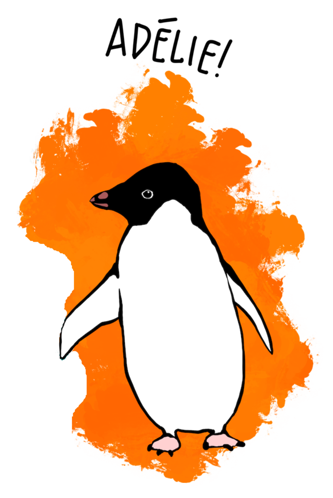
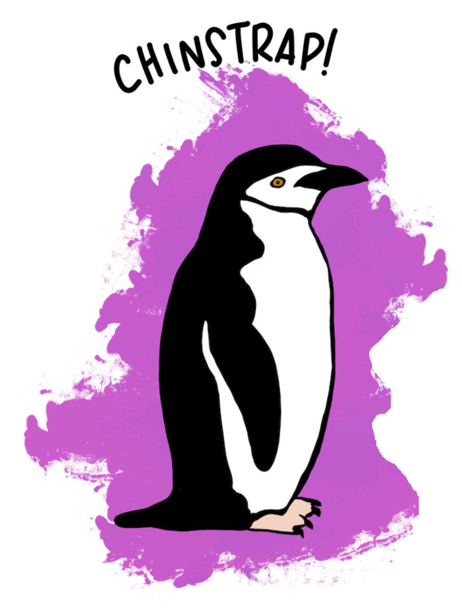
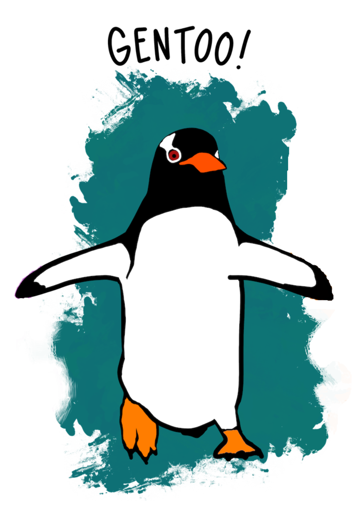

```{r setup, include=FALSE}
knitr::opts_chunk$set(echo = TRUE)
library(palmerpenguins)
library(ggtext)
library(tidyverse)
```

## Penguins

Data are from the `palmerpenguins` package. Data were collected and made available by Dr. Kristen Gorman and the Palmer Station, Antarctica LTER, a member of the Long Term Ecological Research Network.

```{r penguins boxplot, fig.width=10, fig.height=8}
glimpse(penguins)

labels <- c(
  Adelie = "<br>*P. adeliae*",
  Chinstrap = "<br>*P. antarcticus*",
  Gentoo = "<br>*P. papua*"
)

ggplot(penguins, aes(species, body_mass_g)) +
  geom_boxplot() +
  scale_x_discrete(
    name = NULL,
    label = labels
  ) +
  ylab("Body mass (g)") +
  labs(title = "Penguin size, Palmer Station, Antarctica LTER", caption = "Artwork by @allison_horst") +
  theme(
    axis.text.x = element_markdown(color = "black", size = 11),
     plot.title.position = "plot"
  )
```

Gorman KB, Williams TD, Fraser WR (2014) Ecological Sexual Dimorphism and Environmental
Variability within a Community of Antarctic Penguins (Genus Pygoscelis). PLoS ONE 9(3):
e90081. https://doi.org/10.1371/journal.pone.0090081
  
Claus O. Wilke (2020). ggtext: Improved Text Rendering Support for 'ggplot2'. R package
version 0.1.0. https://CRAN.R-project.org/package=ggtext

```{r citation, include=FALSE}
citation("palmerpenguins")
citation("ggtext")
```


